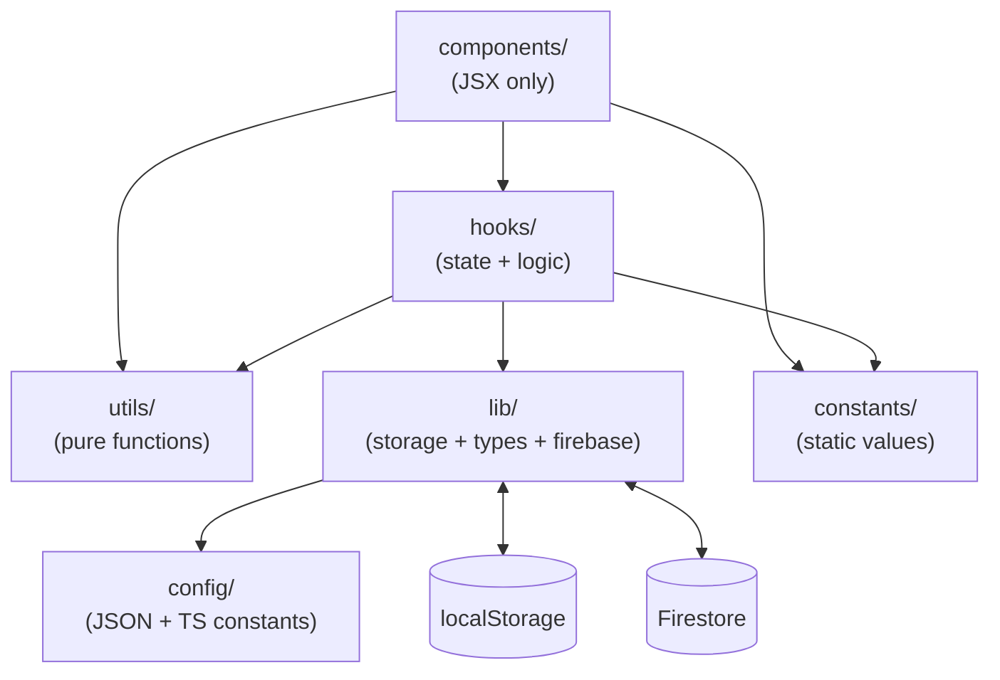
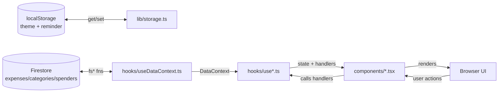

# Architecture

## Layer Dependency Graph



## Directory Layout

```
app/              Pages + root layout + providers (Next.js App Router)
components/       UI only — no state, no logic; each is "use client"
hooks/            All state + business logic; one hook per page/feature
utils/            Pure functions (may return JSX); no hooks, no side effects
lib/              Data layer: types, localStorage wrappers, Firebase init, Firestore API
constants/        Static values: NAV_ITEMS, form validation rule factories
config/           JSON-driven defaults + TS config constants
public/           Static assets: service worker, PWA icons
```

## Layer Rules

| Layer         | Can use                                                     | Cannot use                                    |
| ------------- | ----------------------------------------------------------- | --------------------------------------------- |
| `components/` | hooks, utils, constants, antd, Tailwind                     | Direct localStorage/Firestore, business logic |
| `hooks/`      | lib/, utils, constants, React hooks, app/providers contexts | JSX                                           |
| `utils/`      | Pure TS/TSX                                                 | React hooks, side effects                     |
| `lib/`        | localStorage (client-only guards), Firestore, config        | React hooks                                   |
| `constants/`  | Static values only                                          | Imports from other app layers                 |
| `config/`     | JSON + TS constants                                         | Runtime imports                               |

## Data Flow



Data hooks (`useAddExpense`, `useDashboard`, `useCategoryManager`, `useSpenderManager`) read and write via `useAppData()` — they never touch localStorage or Firestore directly.

## Auth Flow

```
AppShell
  └─ useAuthContext()
       ├─ user === null  →  show SignInPage (redirect to /auth)
       └─ user !== null  →  mount <DataProvider user={user}>
                               └─ useDataContext loads Firestore data
                                  seeds defaults if first sign-in
```

New users (empty Firestore `categories` collection) get:

- Default categories seeded from `config/categories.json`
- Default spender seeded with `id = user.uid`, name from `user.displayName`

## Page → Component Pattern

Every route is a minimal **server component** that imports one `"use client"` component:

```
app/page.tsx              → components/Dashboard.tsx       (uses useDashboard hook)
app/add/page.tsx          → components/AddExpense.tsx      (uses useAddExpense hook)
app/categories/page.tsx   → components/CategoryManager.tsx (uses useCategoryManager hook)
app/settings/page.tsx     → components/ReminderSettings.tsx (uses useReminderSettings hook)
app/spenders/page.tsx     → components/SpenderManager.tsx  (uses useSpenderManager hook)
app/auth/page.tsx         → components/SignInPage.tsx      (uses useAuthContext)
```

`app/layout.tsx` wraps everything with `<Providers>` (Auth + Theme + antd ConfigProvider) and `<AppShell>` (navigation + auth UI).

## Routing

| Route         | Page component   | Auth required |
| ------------- | ---------------- | ------------- |
| `/`           | Dashboard        | Yes           |
| `/add`        | AddExpense form  | Yes           |
| `/categories` | CategoryManager  | Yes           |
| `/spenders`   | SpenderManager   | Yes           |
| `/settings`   | ReminderSettings | Yes           |
| `/auth`       | SignInPage       | No (public)   |

Navigation items are defined in `constants/navigation.tsx` as `NAV_ITEMS` and consumed by `AppShell`.

## Key Config Locations

| What                           | Where                                    |
| ------------------------------ | ---------------------------------------- |
| Default categories             | `config/categories.json`                 |
| Default reminder config        | `config/reminder.json`                   |
| Font CSS variable names        | `config/fonts.ts`                        |
| Nav items + icons              | `constants/navigation.tsx`               |
| Form validation rule factories | `constants/validation.ts`                |
| All TS interfaces              | `lib/types.ts`                           |
| localStorage keys + read/write | `lib/storage.ts`                         |
| Firebase lazy singletons       | `lib/firebase.ts`                        |
| Firestore async CRUD API       | `lib/firestore.ts`                       |
| Firebase env vars              | `.env.local` (from `.env.local.example`) |
| Firestore security rules       | `firestore.rules`                        |
