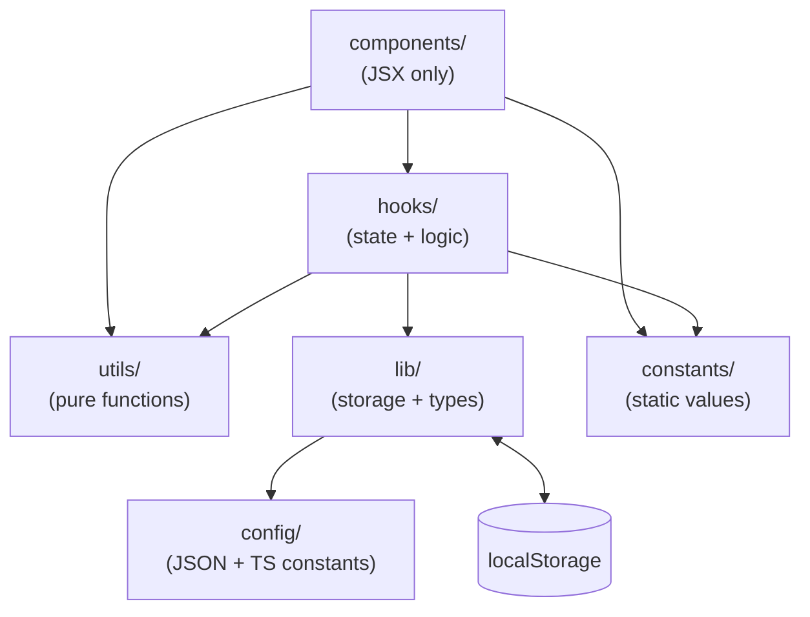
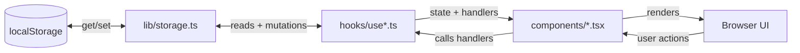

# Architecture

## Layer Dependency Graph



## Directory Layout

```
app/              Pages + root layout + providers (Next.js App Router)
components/       UI only — no state, no logic; each is "use client"
hooks/            All state + business logic; one hook per page/feature
utils/            Pure functions (may return JSX); no hooks, no side effects
lib/              Data layer: types, localStorage wrappers, reminder hook
constants/        Static values: NAV_ITEMS, form validation rule factories
config/           JSON-driven defaults + TS config constants
public/           Static assets: service worker, PWA icons
```

## Layer Rules

| Layer         | Can use                                    | Cannot use                          |
| ------------- | ------------------------------------------ | ----------------------------------- |
| `components/` | hooks, utils, constants, antd, Tailwind    | Direct localStorage, business logic |
| `hooks/`      | lib/storage, utils, constants, React hooks | JSX                                 |
| `utils/`      | Pure TS/TSX                                | React hooks, side effects           |
| `lib/`        | localStorage (client-only guards), config  | React hooks (except `useReminder`)  |
| `constants/`  | Static values only                         | Imports from other app layers       |
| `config/`     | JSON + TS constants                        | Runtime imports                     |

## Data Flow



State never flows upward — all mutations go through the hook that owns that data slice.

## Page → Component Pattern

Every route is a minimal **server component** that imports one `"use client"` component:

```
app/page.tsx              → components/Dashboard.tsx       (usesDashboard hook)
app/add/page.tsx          → components/AddExpense.tsx      (uses useAddExpense hook)
app/categories/page.tsx   → components/CategoryManager.tsx (uses useCategoryManager hook)
app/settings/page.tsx     → components/ReminderSettings.tsx (uses useReminderSettings hook)
app/spenders/page.tsx     → components/SpenderManager.tsx  (uses useSpenderManager hook)
```

`app/layout.tsx` wraps everything with `<Providers>` (theme + antd ConfigProvider) and `<AppShell>` (navigation layout).

## Data Flow

```
localStorage
    ↕
lib/storage.ts  (get/set wrappers)
    ↕
hooks/use*.ts   (state, mutations, derived data)
    ↓
components/*.tsx (render only)
```

State never flows upward — all mutations go through the hook that owns that slice of data.

## Routing

| Route         | Page component   |
| ------------- | ---------------- |
| `/`           | Dashboard        |
| `/add`        | AddExpense form  |
| `/categories` | CategoryManager  |
| `/spenders`   | SpenderManager   |
| `/settings`   | ReminderSettings |

Navigation items are defined in `constants/navigation.tsx` as `NAV_ITEMS` and consumed by `AppShell`.

## Key Config Locations

| What                           | Where                      |
| ------------------------------ | -------------------------- |
| Default categories             | `config/categories.json`   |
| Default reminder config        | `config/reminder.json`     |
| Font CSS variable names        | `config/fonts.ts`          |
| Nav items + icons              | `constants/navigation.tsx` |
| Form validation rule factories | `constants/validation.ts`  |
| All TS interfaces              | `lib/types.ts`             |
| localStorage keys + read/write | `lib/storage.ts`           |
