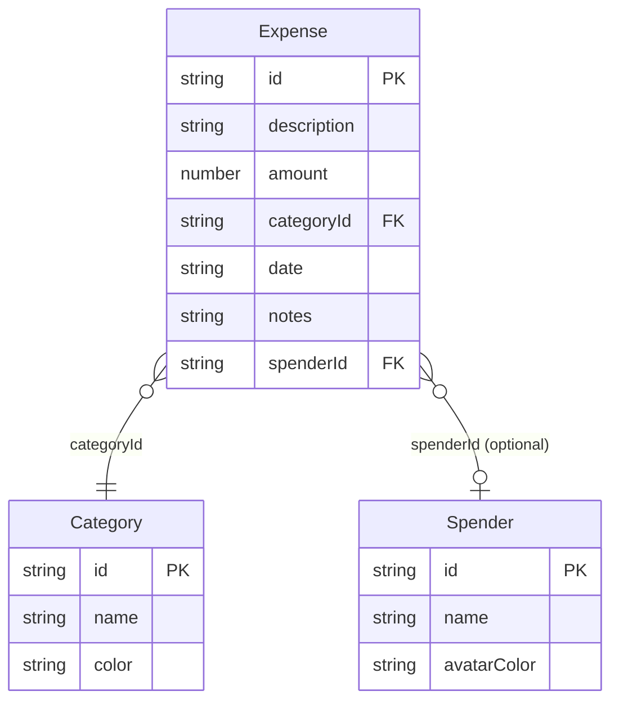

# Data Model

## TypeScript Interfaces (`lib/types.ts`)

```typescript
interface Expense {
  id: string // crypto.randomUUID()
  description: string
  amount: number // always positive, INR
  categoryId: string // references Category.id
  date: string // "YYYY-MM-DD"
  notes?: string
  spenderId?: string // optional, references Spender.id
}

interface Category {
  id: string // "cat-food", "cat-transport", … or UUID for custom
  name: string
  color: string // hex e.g. "#FF6B6B"
}

interface Spender {
  id: string // crypto.randomUUID()
  name: string
  avatarColor: string // hex, used for avatar background
}

type Theme = 'light' | 'dark'

interface ReminderConfig {
  enabled: boolean
  time: string // "HH:MM" 24-hour
}
```

## localStorage Schema

| Key             | Type                | Default                              |
| --------------- | ------------------- | ------------------------------------ |
| `em-expenses`   | `Expense[]`         | `[]`                                 |
| `em-categories` | `Category[]`        | seeded from `config/categories.json` |
| `em-spenders`   | `Spender[]`         | `[]`                                 |
| `em-theme`      | `'light' \| 'dark'` | `'light'`                            |
| `em-reminder`   | `ReminderConfig`    | `{ enabled: false, time: "23:00" }`  |

## Storage API (`lib/storage.ts`)

All methods are SSR-safe (guard against `typeof window === 'undefined'`).

```typescript
storage.getExpenses()   → Expense[]
storage.setExpenses(expenses: Expense[]) → void

storage.getCategories() → Category[]   // seeds defaults on first call
storage.setCategories(categories: Category[]) → void

storage.getSpenders()   → Spender[]
storage.setSpenders(spenders: Spender[]) → void

storage.getTheme()      → Theme
storage.setTheme(theme: Theme) → void

storage.getReminder()   → ReminderConfig
storage.setReminder(config: ReminderConfig) → void
```

## Default Categories (`config/categories.json`)

Seeded once on first `getCategories()` call if `em-categories` is absent:

| ID                  | Name          | Color     |
| ------------------- | ------------- | --------- |
| `cat-food`          | Food & Dining | `#FF6B6B` |
| `cat-transport`     | Transport     | `#4ECDC4` |
| `cat-shopping`      | Shopping      | `#45B7D1` |
| `cat-entertainment` | Entertainment | `#96CEB4` |
| `cat-health`        | Health        | `#F6AD55` |
| `cat-utilities`     | Utilities     | `#DDA0DD` |
| `cat-other`         | Other         | `#94A3B8` |

Custom categories get UUID ids; built-in ones use the `cat-*` prefix.

## Entity Relationships



## Relationships

- `Expense.categoryId` → `Category.id` (required; no FK enforcement)
- `Expense.spenderId` → `Spender.id` (optional)
- Deleting a Category while expenses reference it is **prevented** in `useCategoryManager`
- Deleting a Spender while expenses reference it is **prevented** in `useSpenderManager`

## ID Generation

All new records use `crypto.randomUUID()`. No sequential IDs.
