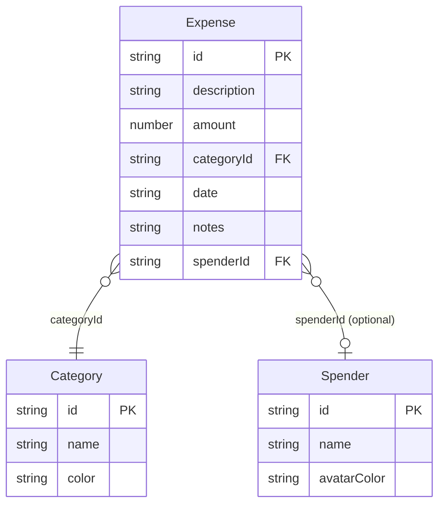

# Data Model

## TypeScript Interfaces (`lib/types.ts`)

```typescript
interface Expense {
  id: string // crypto.randomUUID()
  description: string
  amount: number // always positive, INR
  categoryId: string // references Category.id
  date: string // "YYYY-MM-DD"
  notes?: string
  spenderId?: string // optional, references Spender.id
}

interface Category {
  id: string // "cat-food", "cat-transport", … or UUID for custom
  name: string
  color: string // hex e.g. "#FF6B6B"
}

interface Spender {
  id: string // user.uid for the seeded self-spender; crypto.randomUUID() for others
  name: string
  avatarColor: string // hex, used for avatar background
}

type Theme = 'light' | 'dark'

interface ReminderConfig {
  enabled: boolean
  time: string // "HH:MM" 24-hour
}

interface BudgetConfig {
  enabled: boolean
  // per-category budget limits and/or a global monthly limit
  [key: string]: unknown
}
```

## Firestore Schema

Primary data store. Path: `users/{uid}/{collection}/{docId}`.

| Collection   | Doc ID        | Type            | Notes                                           |
| ------------ | ------------- | --------------- | ----------------------------------------------- |
| `expenses`   | `expense.id`  | `Expense`       | `undefined` fields stripped before write        |
| `categories` | `category.id` | `Category`      | Seeded on first sign-in if empty                |
| `spenders`   | `spender.id`  | `Spender`       | Seeded with user's own spender on first sign-in |
| `settings`   | `"data"`      | `CloudSettings` | Merged; holds `theme`, `reminder`, `migrated`   |

### Firestore API (`lib/firestore.ts`)

```typescript
fsGetExpenses(uid)                    → Promise<Expense[]>
fsSetExpenses(uid, expenses)          → Promise<void>   // batch replace

fsGetCategories(uid)                  → Promise<Category[]>
fsSetCategories(uid, categories)      → Promise<void>   // batch replace

fsGetSpenders(uid)                    → Promise<Spender[]>
fsSetSpenders(uid, spenders)          → Promise<void>   // batch replace

fsGetSettings(uid)                    → Promise<CloudSettings>
fsSetSettings(uid, settings)          → Promise<void>   // merge

fsSeedDefaultCategories(uid)          → Promise<void>
fsSeedDefaultSpender(uid, spender)    → Promise<void>
```

All writes use Firestore `writeBatch` for atomicity (batch replace = delete all + re-write).

## localStorage Schema

Used only for **theme**, **reminder**, and **budget** (not synced to Firestore).

| Key           | Type                | Default                             |
| ------------- | ------------------- | ----------------------------------- |
| `em-theme`    | `'light' \| 'dark'` | `'light'`                           |
| `em-reminder` | `ReminderConfig`    | `{ enabled: false, time: "23:00" }` |
| `em-budget`   | `BudgetConfig`      | `{ enabled: false }`                |

### Storage API (`lib/storage.ts`)

All methods are SSR-safe (guard against `typeof window === 'undefined'`).

```typescript
storage.getTheme()      → Theme
storage.setTheme(theme: Theme) → void

storage.getReminder()   → ReminderConfig
storage.setReminder(config: ReminderConfig) → void

storage.getBudget()     → BudgetConfig
storage.setBudget(config: BudgetConfig) → void
```

## Default Seeding (new users)

On first sign-in, `useDataContext` checks if Firestore `categories` is empty and seeds:

### Default Categories (`config/categories.json`)

| ID                  | Name          | Color     |
| ------------------- | ------------- | --------- |
| `cat-food`          | Food & Dining | `#FF6B6B` |
| `cat-transport`     | Transport     | `#4ECDC4` |
| `cat-shopping`      | Shopping      | `#45B7D1` |
| `cat-entertainment` | Entertainment | `#96CEB4` |
| `cat-health`        | Health        | `#F6AD55` |
| `cat-utilities`     | Utilities     | `#DDA0DD` |
| `cat-other`         | Other         | `#94A3B8` |

### Default Spender

A spender is seeded with `id = user.uid`, `name = user.displayName ?? user.email ?? 'Me'`, `avatarColor = '#6366f1'`. Because `id === user.uid`, `useSpenderManager` can identify this spender as "You" via `currentUserId`.

Custom categories get UUID ids; built-in ones use the `cat-*` prefix.

## Entity Relationships



## Relationships

- `Expense.categoryId` → `Category.id` (required; no FK enforcement)
- `Expense.spenderId` → `Spender.id` (optional)
- Deleting a Category while expenses reference it is **prevented** in `useCategoryManager`
- Deleting a Spender while expenses reference it is **prevented** in `useSpenderManager`

## ID Generation

All new records use `crypto.randomUUID()` except the seeded self-spender which uses `user.uid`.
