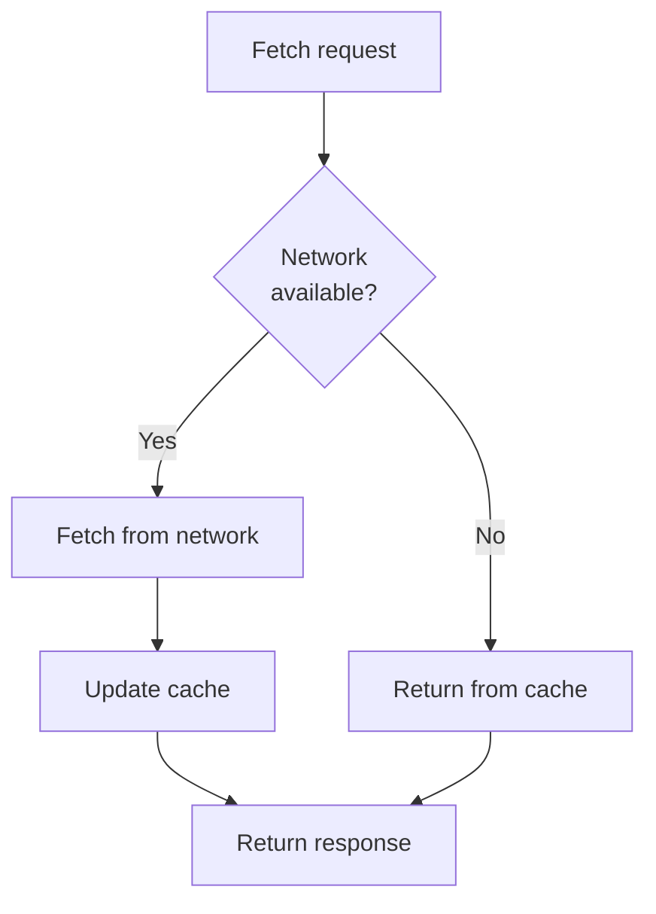
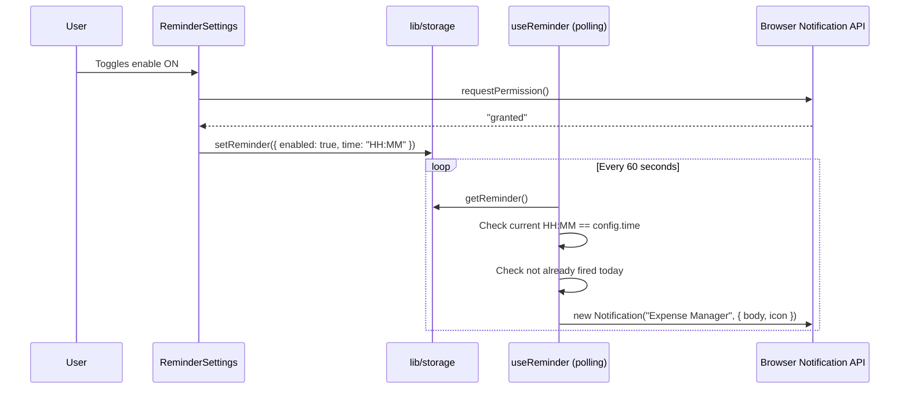

# PWA & Notifications

## Service Worker (`public/sw.js`)

**Strategy:** Network-first with cache fallback.

**Static pre-cache on install:** `/`, `/categories`, `/spenders`, `/settings`

**Cache name:** `em-v1` — bump this string to force cache invalidation on deploy.

**Activation:** Old caches with different names are deleted. `clients.claim()` takes control immediately.

**Registration:** `hooks/useAppShell.ts` calls `navigator.serviceWorker.register('/sw.js')` inside a `useEffect` in `AppShell` (runs on every page).

---

## PWA Manifest (`app/manifest.ts`)

Generated at `/manifest.webmanifest` via Next.js built-in manifest route.

| Field              | Value           |
| ------------------ | --------------- |
| `name`             | Expense Manager |
| `short_name`       | Expenses        |
| `start_url`        | `/`             |
| `display`          | `standalone`    |
| `orientation`      | `portrait`      |
| `background_color` | `#f9fafb`       |
| `theme_color`      | `#6366f1`       |

**Icons:**

- `public/icons/icon-192.svg` — 192×192, `maskable`
- `public/icons/icon-512.svg` — 512×512, `any`

---

## Notification System

**Hook:** `lib/useReminder.ts` — mounted in `AppShell`, runs on every page.

**Fire conditions (all must be true):**

1. `config.enabled === true`
2. `Notification.permission === 'granted'`
3. Current `HH:MM` matches `config.time`
4. `lastFiredRef.current !== today` (prevents duplicate in the same minute)

**Permission flow:**

- Requested only when user enables the toggle in Settings
- If denied, toggle stays off and a warning toast is shown
- Re-enabling re-requests permission

**Configuration storage:** `em-reminder` key → `{ enabled: boolean, time: "HH:MM" }`

**Default:** `{ enabled: false, time: "23:00" }` from `config/reminder.json`
