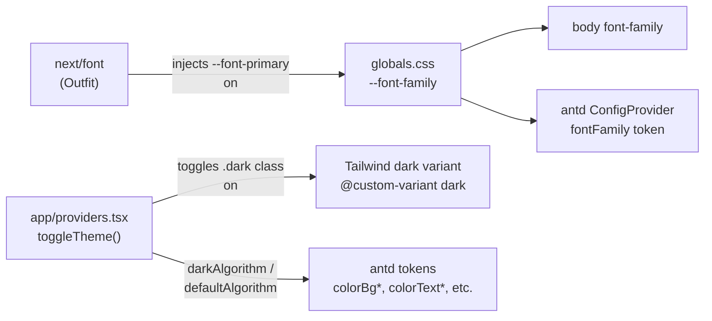
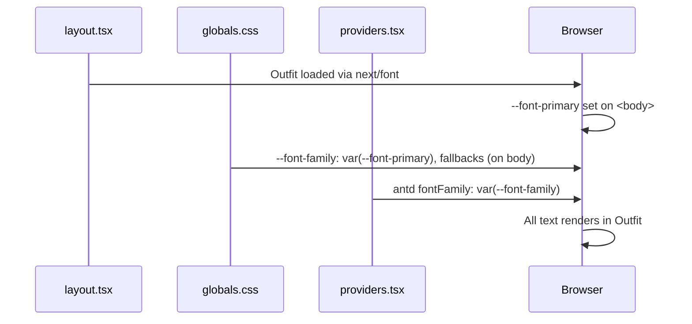

# Styling

## System Overview



Two parallel systems handle visual styling — **Tailwind** for layout/spacing, **antd tokens** for all colors:

| Concern                      | Tool                               |
| ---------------------------- | ---------------------------------- |
| Layout, spacing, grid, flex  | Tailwind CSS v4                    |
| Colors, borders, backgrounds | antd `theme.useToken()`            |
| Dark mode colors             | antd `darkAlgorithm` (automatic)   |
| Dark mode layout variants    | Tailwind `dark:` (structural only) |
| Typography                   | antd token + CSS `--font-family`   |

**Rule:** Never use Tailwind `dark:text-*`, `dark:bg-*`, etc. for colors. Use `token.colorText`, `token.colorBgContainer`, etc. so they adapt automatically with the antd algorithm.

---

## Theme System

**Provider:** `app/providers.tsx`

- Reads saved theme from `em-theme` in localStorage on mount
- Exposes `useTheme()` context: `{ theme: 'light' | 'dark', toggleTheme }`
- Toggles `.dark` CSS class on `<html>` for Tailwind structural variants
- Passes `darkAlgorithm` or `defaultAlgorithm` to antd `ConfigProvider`

**Switching theme in a component:**

```tsx
const { theme, toggleTheme } = useTheme()
// theme === 'light' | 'dark'
```

**Using colors in a component:**

```tsx
const { token } = theme.useToken()
// token.colorBgContainer, token.colorText, token.colorPrimary, etc.
```

---

## antd Token Overrides (`app/providers.tsx`)

```typescript
token: {
  colorPrimary: '#6366f1',   // indigo
  borderRadius: 8,
  fontFamily: `var(--font-family)`,
}
```

---

## Font Setup



**To change the font:**

1. Update `import { Outfit }` → new font in `app/layout.tsx`
2. Update `--font-family` fallback stack in `app/globals.css`
   That's all — antd and body pick it up automatically.

**CSS variable chain:**

- `--font-primary` → set on `<body>` by next/font (via className)
- `--font-family` → defined on `body`, references `--font-primary` + fallbacks
- `body { font-family: var(--font-family) }` — applied to all content
- antd `fontFamily` token → `var(--font-family)` — applied to all antd components

Constant names live in `config/fonts.ts`:

```typescript
PRIMARY_FONT_CSS_VAR = '--font-primary'
FONT_FAMILY_CSS_VAR = '--font-family'
```

---

## Tailwind v4 Notes

- Config is in `postcss.config.mjs` (no `tailwind.config.js` needed for v4)
- Custom dark variant: `@custom-variant dark (&:where(.dark, .dark *))` in `globals.css`
- Spacing always multiples of 4: `p-4`, `p-8`, `gap-4`, etc.
- Responsive breakpoints: mobile-first → `lg:grid-cols-2`, `md:hidden`, `hidden md:flex`
- Single column on mobile → two columns on `lg:` for dashboard panels

---

## CSS Custom Properties

Defined in `globals.css`:

```css
:root {
  --background: #f9fafb; /* page background (light) */
  --foreground: #111827; /* text (light) */
}

.dark {
  --background: #0f0f0f;
  --foreground: #f3f4f6;
}

body {
  --font-family: var(--font-primary), 'Noto Sans JP', 'Noto Sans', Vazirmatn, sans-serif;
}
```
